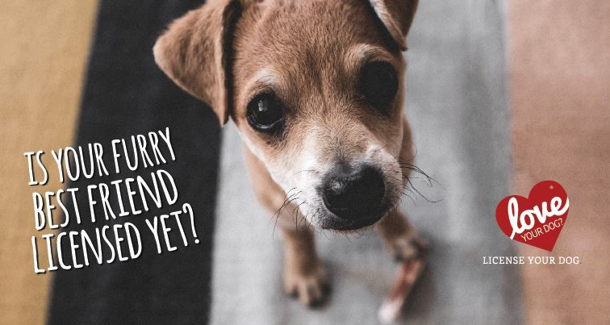

<h5 style="text-align: center;" markdown="1">Group Member: Shuhong Xiang(sx2289), Xinyi Wang(xw2758), Ling Tuo(lt2812), Zhixing Wu(zw2709), Yali Zhai(yz3956)</h6>

## Overview

Dog license acquisition seems to be complicated by different policies in different states. In PA, there exists a convenient lifetime license type. We take Allegheny County in PA as an example for analysis the lifetime dog license. (There are so much dog people in the U.S.!) In this project, we analyze the various dog license types with breed, color, zipcode and valid date. 

## Dataset

All data can be found [here](https://drive.google.com/drive/folders/1-2856h3a4ZFUfNBv1u6TQdKJj1_zZ1Yv
). Especially, the license dataset was sourced from [alleghenycounty.us](http://infoportal.alleghenycounty.us/dogdata/default.aspx). We obtained lifetime license data while information of other non-lifetime license with Expire year range from 2007 to 2020 are also available on the website. Variables in this dataset are: License type, breed, color, dog name, ownerzip, expire year, valid date. The expiration year of 2099 indicates the Lifetime License, which is valid for the life of the dog.

## Motivation

According the [PetPlace website](https://www.petplace.com/article/dogs/pet-health/the-purpose-of-pet-licenses-for-dogs/), licensing the pet is considered to have many benefits. For example, licensing might help to reunite the pet with its family by telling animal control officers that a dog or cat has an owner. Additionally, emergency treatment could be guaranteed if the pet is found injured based on the license and we could keep track of how many pets a person owns using the licenses.

And we mainly focus on the dog license and the acquisition seems to be complicated by states. We take Allegheny County, PA as an example since they have special regulations of dog lifetime licenses. Based on [An Official Pennsylvania Government Website](https://www.agriculture.pa.gov/Animals/DogLaw/License_Your_Dog/Pages/default.aspx), it seems that in PA all dogs three months or older must be licensed by January 1 of each year and violators can be cited with a maximum fine of $300 per violation plus court costs. This project is designed to analyze potential associated indicators and distributions of the dog life license.

## Tidy data

+ In terms of the license type, we delete three types: "Dog Lifetime Duplicate", "Dog Out of County Transfer - Lifetime", "Dog Inter County Transfer - Lifetime", and use "N/S" to denote the Neutered Male and Spayed Female.

+ For breed type, we separate the breed into two types: "mixed" and "pure". All the breeds whose name contains "mix" are belong to mixed and others are pure.

+ For the color type, we delete some items and combine variables with same meanings. We look for the TOP 5~10 colors as well as proportion of the number of colors and suggest that "MULTI", "TRI-COLOR" and other specific 3 colors might have 3+ colors.

+ There is some zip code that are not in Allegheny County, such as 16229, 46845 and so on. We only select zip code of cities that belong to Allegheny County.

+ When it comes to valid date, We remain the years of the validation data and convert the specific time to AM and PM of a day.

## Conclusions

+ About license type, the most popular one is “Dog Lifetime N/S” ( total counts of 24692), while the type “Dog Senior Lifetime” seems to be least chosen (total counts of 496).

+ The distribution of license counts between Female and Male group does not show large difference in all four types

+ About color, the pure color dogs have the largest number while dogs mixed of more than 3 colors have the least. The most popular color is black, even in two-color and mixed color groups.

+ The number of licenses of the pure breed is about  twice as much the license of the mixed breed. LAB MIX and LABRADOR RETRIEVER are the top one in the mixed and pure group respectively, much more than other breeds.

+ Regarding regional distribution, people in Pittsburgh hold less licenses, while people in Ross Township and Bethel Park hold the largest number of lifetime licenses.

+ There exists a linear relationship between the number of the total lifetime dog licenses and the year of valid year from 2003 to the 2019. However, in 2020, the number of the lifetime licenses decreased a little, which might result from the Covid-19.

+ About the preference of time, people tend to obtain lifetime licenses in the afternoon  rather than in the morning.

## Discussion 

There are no significant correlation between color & breed type, color & license type. However, there is a robust (R square = 0.99) linear relationship between the number of the total lifetime dog licenses and the year of valid year from 2003 to the 2019. Thus, we can predict the the number of total dog lifetime licenses in the future under normal circumstances. Therefore, we can use the the predicted number to compare with the actual number of licenses, which implies the effects of Covid-19 on dog lifetime licenses.

