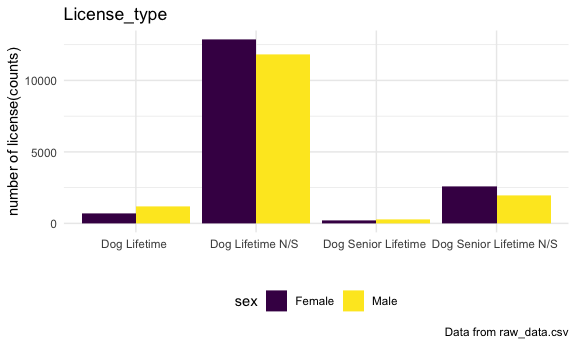
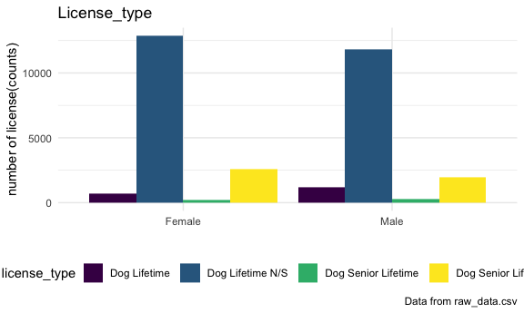

license\_type
================

``` r
library(tidyverse)
knitr::opts_chunk$set(
  fig.width = 6,
  fig.asp = 0.6,
  out.width = '90%'
)
theme_set(theme_minimal()+ theme(legend.position = 'bottom'))

options(
  ggplot2.continuous.colour = 'viridis',
  ggplot2.continuous.fill = 'viridis'
)

scale_colour_discrete = scale_color_viridis_d
scale_fill_discrete = scale_fill_viridis_d
```

# License\_type

In terms of the license type, we delete three types: “Dog Lifetime
Duplicate”, “Dog Out of County Transfer - Lifetime”, “Dog Inter County
Transfer - Lifetime”.

We mainly focus on the remaining four types which are all lifetime
licenses.

Since the Neutered Male and Spayed Female could be classified into one
situation, then we use “N/S” to denote the Neutered Male and Spayed
Female.

``` r
raw_data = read_csv("raw_data.csv")

tidy_data = raw_data %>% 
 janitor::clean_names() %>% 
 select(license_type, breed, color, owner_zip, valid_date)
 
tidy_data = 
 tidy_data %>% 
 filter(!(license_type %in% c("Dog Lifetime Duplicate", "Dog Out of County Transfer - Lifetime", "Dog Inter County Transfer - Lifetime"))) %>% 

 mutate(
    license_type = str_replace(license_type, "Male", "_Male"),
    license_type = str_replace(license_type, "Female", "_Female"),
    license_type = str_replace(license_type, "Neutered", "N/S"),
    license_type = str_replace(license_type, "Spayed", "N/S")) %>% 
 separate(license_type, into = c("license_type", "sex"), sep = "_")
```

Firstly, we compare number of licenses between Male and Female,
obtaining the result that the two percents are approximately 50% with
Female type having a bit larger counts.

  - Sex Analysis

<!-- end list -->

``` r
# sex 
tidy_data %>% 
 count(sex) %>% 
 rename(number_of_licenses = n) %>% 
 mutate(percentage = number_of_licenses / (16411 + 15254)) %>% 
 knitr::kable()
```

| sex    | number\_of\_licenses | percentage |
| :----- | -------------------: | ---------: |
| Female |                16411 |  0.5182694 |
| Male   |                15254 |  0.4817306 |

  - License type & Sex Analysis

Secondly, the following table and plot represent the number of licenses
in Female and Male groups.

Apparently, the most popular license type is “Dog Lifetime N/S” with a
total number of 24692, while the type “Dog Senior Lifetime” seems to be
least chosen (total counts of 496).

The distribution of license counts between Female and Male group does
not show large difference in these four types, which is consistent with
previous sex analysis.

``` r
table1 = 
 tidy_data %>% 
 count(license_type, sex) %>% 
 pivot_wider(names_from = sex, values_from = n) %>% 
  
 mutate(total = Female + Male) 
 
table1 %>% 
  knitr::kable()
```

| license\_type           | Female |  Male | total |
| :---------------------- | -----: | ----: | ----: |
| Dog Lifetime            |    732 |  1185 |  1917 |
| Dog Lifetime N/S        |  12862 | 11830 | 24692 |
| Dog Senior Lifetime     |    223 |   273 |   496 |
| Dog Senior Lifetime N/S |   2594 |  1966 |  4560 |

``` r
plot1 = 
  tidy_data %>% 

  ggplot(aes(x = license_type, fill = sex)) +
  geom_bar(position = "dodge") +  # bar plot
 
 
 labs(
    title = "License_type",
    x = "",
    y = "number of license(counts)",
    caption = "Data from raw_data.csv"
  ) + 
  viridis::scale_color_viridis(
    name = 'Sex',
    discrete = TRUE) +
  theme(legend.position = 'bottom')

plot1
```



  - Price Analysis

Thirdly, we calculate the total price for the four types based on the
single price.

The type “Dog Lifetime” has most expensive price per license, but the
“Dog Lifetime N/S” group has largest total prices due to its large
counts.

``` r
price_df = 
  tibble(
    total = c(1917,24692,496,4560),
    single_price = c(51.5,31.5,31.5,21.5)
  )

price_ = 
  left_join(table1, price_df, by = "total") %>% 
  select(-Female, -Male) %>% 
  mutate(total_price = total * single_price)
  
price_ %>% 
  knitr::kable()
```

| license\_type           | total | single\_price | total\_price |
| :---------------------- | ----: | ------------: | -----------: |
| Dog Lifetime            |  1917 |          51.5 |      98725.5 |
| Dog Lifetime N/S        | 24692 |          31.5 |     777798.0 |
| Dog Senior Lifetime     |   496 |          31.5 |      15624.0 |
| Dog Senior Lifetime N/S |  4560 |          21.5 |      98040.0 |

  - Sex & License type Analysis

Finally, we study the choices of different types from the perspective of
sex.

For both male and female dogs, the number of license counts differ a lot
among four types. Specifically, the counts for “Dog Lifetime N/S” group
seem to be six times of the counts for “Dog Senior Lifetime” group for
both male and female dogs.

Additionally, the pattern of license types tend to be the same for male
and female groups, with same license type of largest and smallest
counts.

``` r
table2 = 
 tidy_data %>% 
 count(sex, license_type) %>% 
 pivot_wider(names_from = license_type, values_from = n) %>% 
 knitr::kable()
  

table2
```

| sex    | Dog Lifetime | Dog Lifetime N/S | Dog Senior Lifetime | Dog Senior Lifetime N/S |
| :----- | -----------: | ---------------: | ------------------: | ----------------------: |
| Female |          732 |            12862 |                 223 |                    2594 |
| Male   |         1185 |            11830 |                 273 |                    1966 |

``` r
plot2 = 
  tidy_data %>% 

  ggplot(aes(x = sex, fill = license_type)) +
  geom_bar(position = "dodge") +  # bar plot
 
 
 labs(
    title = "License_type",
    x = "",
    y = "number of license(counts)",
    caption = "Data from raw_data.csv"
  ) + 
  viridis::scale_color_viridis(
    name = 'Sex',
    discrete = TRUE) +
  theme(legend.position = 'bottom')

plot2
```


